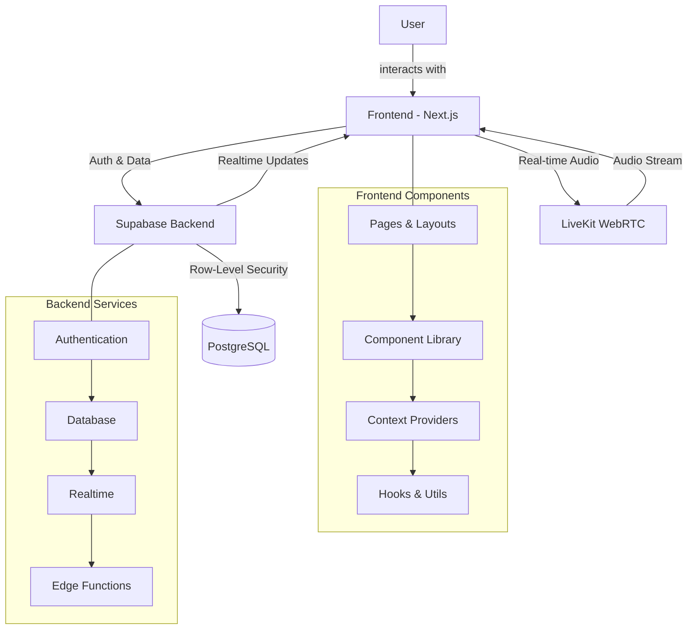

<div align="center">

<picture>
  <source media="(prefers-color-scheme: dark)" srcset="https://raw.githubusercontent.com/ttvtimotheus/clarik/main/public/logo-dark.png">
  <source media="(prefers-color-scheme: light)" srcset="https://raw.githubusercontent.com/ttvtimotheus/clarik/main/public/logo-light.png">
  
</picture>

# 🎙️ **CLARIK**

_Die nächste Generation von Audio-Diskussionsräumen_

[](https://nextjs.org/)
[](https://www.typescriptlang.org/)
[](https://supabase.io/)
[](https://livekit.io/)
[](https://tailwindcss.com/)
[](https://vercel.com/)

**Moderne Echtzeit-Audioplattform für strukturierte Gespräche**  
*Intuitive Benutzerführung · Hochwertige Audioqualität · Intelligente Raumverwaltung*

[🚀 Features](#-features) • 
[🛠️ Tech-Stack](#%EF%B8%8F-tech-stack) • 
[🔧 Setup](#-setup) • 
[📱 Screenshots](#-screenshots) • 
[⚙️ Architektur](#%EF%B8%8F-architektur) • 
[🚀 Deployment](#-deployment) • 
[📜 Lizenz](#-lizenz)

</div>

---

## 🚀 Features

<div align="center">

| | Benutzer | | Räume | | Audio |
|:-:|:---------|:-:|:--------|:-:|:--------|
| 🔐 | **Authentifizierung** <br/> Magic Links & Passkeys | 🏠 | **Raumverwaltung** <br/> Erstellen, Einladen, Verwalten | 🎙️ | **HD Audio** <br/> Kristallklare Sprachqualität |
| 👤 | **Profilverwaltung** <br/> Personalisierte Avatare | 📅 | **Zeitplanung** <br/> Geplante und spontane Räume | 🔊 | **Noise Cancellation** <br/> Unterdrückung von Hintergrundgeräuschen |
| 🔔 | **Benachrichtigungen** <br/> Echtzeit-Updates | 👥 | **Rollenmanagement** <br/> Moderator, Speaker, Listener | ✋ | **Wortmeldungen** <br/> Intelligente Speaker-Queue |
| 🌙 | **Dark Mode** <br/> Augenschonende Nutzung | 🔍 | **Raum-Discovery** <br/> Themenbasierte Raumsuche | 📊 | **Sprachaktivität** <br/> Visuelle Sprecher-Indikatoren |
| 📱 | **Responsive Design** <br/> Desktop & Mobile optimiert | 🔒 | **Privatsphäre** <br/> Öffentliche/Private Räume | ⚡ | **Niedrige Latenz** <br/> Verzögerungsfreie Kommunikation |

</div>

### ✨ Besonderheiten

- **Admin-Dashboard** – Umfassende Plattformüberwachung und Nutzerverwaltung
- **Realtime-Infrastruktur** – Sofortige Synchronisation aller Änderungen
- **Skalierbare Architektur** – Entworfen für hohe Nutzer- und Raumzahlen
- **Fokus auf UX** – Intuitive Benutzerführung für alle Altersgruppen

## 🛠️ Tech-Stack

<table align="center">
  <tr>
    <td align="center" width="100">
      
      <br>Next.js 14
    </td>
    <td align="center" width="100">
      
      <br>TypeScript
    </td>
    <td align="center" width="100">
      
      <br>Tailwind
    </td>
    <td align="center" width="100">
      
      <br>shadcn/ui
    </td>
    <td align="center" width="100">
      
      <br>React
    </td>
  </tr>
  <tr>
    <td align="center" width="100">
      
      <br>Supabase
    </td>
    <td align="center" width="100">
      
      <br>PostgreSQL
    </td>
    <td align="center" width="100">
      
      <br>LiveKit
    </td>
    <td align="center" width="100">
      
      <br>Zustand
    </td>
    <td align="center" width="100">
      
      <br>Vercel
    </td>
  </tr>
</table>

<div align="center">

### Architektur-Highlights

**Frontend:** App Router · Server Components · Streaming · Suspense  
**Backend:** Row-Level Security · Realtime Subscriptions · Edge Functions  
**Audio:** WebRTC · SFU-Architektur · Opus-Codec · Automatische Skalierung

</div>

## 🔧 Setup

<table>
<tr>
<td>

### 🚀 Schnellstart

```bash
# Repository klonen
git clone https://github.com/ttvtimotheus/clarik.git
cd clarik

# Abhängigkeiten installieren
npm install

# Entwicklungsserver starten
npm run dev

# Besuche http://localhost:3000
```

</td>
<td>

### 🔑 Voraussetzungen

- Node.js 18+ und npm/yarn/pnpm
- Supabase-Konto (kostenlose Tier ausreichend)
- LiveKit-Konto (kostenlose Tier für Entwicklung)
- GitHub-Konto für Deployment über Vercel

</td>
</tr>
</table>

### ⚙️ Umgebungsvariablen

Erstelle eine `.env.local` Datei im Projektroot:

```env
# Supabase Konfiguration
NEXT_PUBLIC_SUPABASE_URL=https://your-project-id.supabase.co
NEXT_PUBLIC_SUPABASE_ANON_KEY=your-anon-key

# LiveKit Konfiguration
LIVEKIT_API_KEY=your-livekit-api-key
LIVEKIT_API_SECRET=your-livekit-api-secret
NEXT_PUBLIC_LIVEKIT_URL=wss://your-livekit-instance.livekit.cloud
```

### 🗃️ Datenbank einrichten

1. Erstelle ein neues Projekt auf [Supabase](https://supabase.com)
2. Führe die SQL-Skripte in der folgenden Reihenfolge aus:
   - [`lib/supabase/schema.sql`](./lib/supabase/schema.sql) (Basisschema)
   - [`lib/supabase/admin-schema.sql`](./lib/supabase/admin-schema.sql) (Admin-Funktionen)
   - [`lib/supabase/secure-admin-views.sql`](./lib/supabase/secure-admin-views.sql) (Sichere Views)
3. Aktiviere die Authentication-Dienste:
   - Email mit "Confirm email" aktivieren
   - Passkey-Authentifizierung aktivieren

### 🎙️ LiveKit konfigurieren

1. Erstelle ein neues Projekt auf [LiveKit Cloud](https://livekit.io)
2. Kopiere API-Key und Secret in die `.env.local`
3. Optional: Für Produktionsumgebungen eigenes LiveKit-Cluster aufsetzen

## 📱 Screenshots

<table>
  <tr>
    <td></td>
    <td></td>
    <td></td>
  </tr>
  <tr>
    <td align="center"><b>Homepage</b></td>
    <td align="center"><b>Audio Room</b></td>
    <td align="center"><b>Admin Dashboard</b></td>
  </tr>
</table>

> *Ersetze die Platzhalter-Bilder durch echte Screenshots deiner Anwendung*

## ⚙️ Architektur



### 📂 Projektstruktur

<table>
<tr>
<td>

```
📦 clarik
 ┣ 📂 app                 # Next.js App Router
 ┃ ┣ 📂 account           # Benutzereinstellungen
 ┃ ┣ 📂 admin             # Admin-Dashboard
 ┃ ┣ 📂 api               # API-Routen
 ┃ ┣ 📂 auth              # Authentifizierung
 ┃ ┣ 📂 rooms             # Raum-Seiten
 ┃ ┗ 📜 layout.tsx        # Root-Layout
 ┣ 📂 components          # UI-Komponenten
 ┃ ┣ 📂 auth              # Auth-Komponenten
 ┃ ┣ 📂 providers         # Context-Provider
 ┃ ┣ 📂 room              # Raum-Komponenten
 ┃ ┗ 📂 ui                # UI-Komponenten
```

</td>
<td>

```
 ┣ 📂 lib                 # Bibliotheken
 ┃ ┣ 📂 hooks             # Custom Hooks
 ┃ ┣ 📂 store             # Zustand Stores
 ┃ ┣ 📂 supabase          # Supabase Client
 ┃ ┗ 📂 utils             # Hilfsfunktionen
 ┣ 📂 public              # Statische Assets
 ┣ 📜 .env.example        # Beispiel-Umgebungsvariablen
 ┣ 📜 .gitignore          # Git-Ignore-Datei
 ┣ 📜 middleware.ts       # Next.js Middleware
 ┣ 📜 next.config.js      # Next.js-Konfiguration
 ┣ 📜 package.json        # Abhängigkeiten
 ┣ 📜 README.md           # Projektdokumentation
 ┗ 📜 tsconfig.json       # TypeScript-Konfiguration
```

</td>
</tr>
</table>

## 🚀 Deployment

<div align="center">
<a href="https://vercel.com/new/clone?repository-url=https%3A%2F%2Fgithub.com%2Fttvtimotheus%2Fclarik&env=NEXT_PUBLIC_SUPABASE_URL,NEXT_PUBLIC_SUPABASE_ANON_KEY,LIVEKIT_API_KEY,LIVEKIT_API_SECRET,NEXT_PUBLIC_LIVEKIT_URL&project-name=clarik&repository-name=clarik">
  
</a>
</div>

### 🌐 Frontend

**One-Click-Deployment mit Vercel:**
1. Klicke auf den Button oben
2. Verbinde dein GitHub-Konto
3. Konfiguriere die Umgebungsvariablen:
   - `NEXT_PUBLIC_SUPABASE_URL`
   - `NEXT_PUBLIC_SUPABASE_ANON_KEY`
   - `LIVEKIT_API_KEY`
   - `LIVEKIT_API_SECRET`
   - `NEXT_PUBLIC_LIVEKIT_URL`

### 🔐 Backend

Dein Supabase-Projekt dient als Backend und ist bereits gehostet. Für die Produktion empfehlen wir:

1. Upgrade auf den Supabase Pro-Plan für Produktionsworkloads
2. Aktiviere täglich Backups der Datenbank
3. Konfiguriere CORS-Einstellungen für deine Domain
4. Konfiguriere den SMTP-Server für E-Mail-Benachrichtigungen

### 🔊 Audio-Server

LiveKit Cloud bietet eine gehostete Lösung für die WebRTC-Funktionalität:

1. Für Produktionsumgebungen wähle den passenden Plan nach erwarteter Nutzerzahl
2. Konfiguriere regionale Server für niedrige Latenz
3. Stelle sicher, dass die LiveKit-Tokens korrekt generiert werden

## 🌟 Community & Beiträge

Beiträge sind willkommen! So kannst du helfen:

- 🐛 **Issues** - Bug-Reports und Feature-Requests einreichen
- 🔀 **Pull Requests** - Code-Verbesserungen vorschlagen
- 📖 **Dokumentation** - Zur Dokumentation beitragen
- 🧪 **Tests** - Helfen, die Testabdeckung zu verbessern

## 📜 Lizenz

Dieses Projekt ist unter der [MIT-Lizenz](LICENSE) lizenziert.

---

<div align="center">
Mit ❤️ entwickelt von <a href="https://github.com/ttvtimotheus">Timotheus</a>
<br>
<br>

[🔝 Zurück nach oben](#-clarik)
</div>